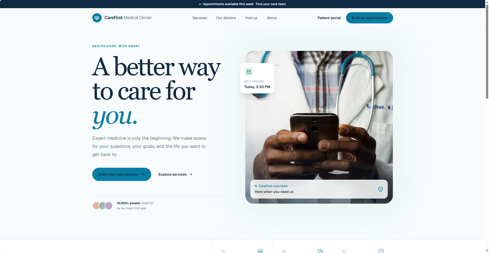
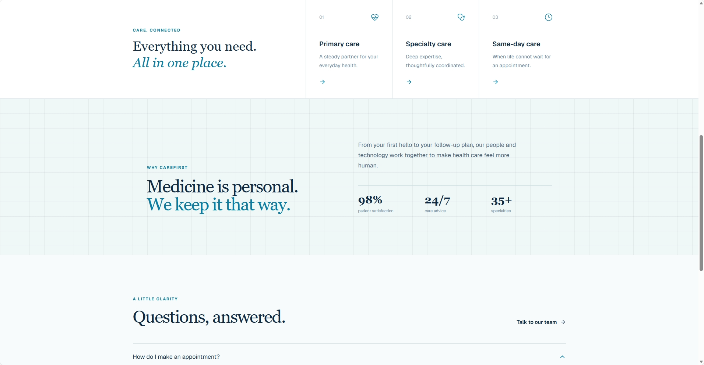
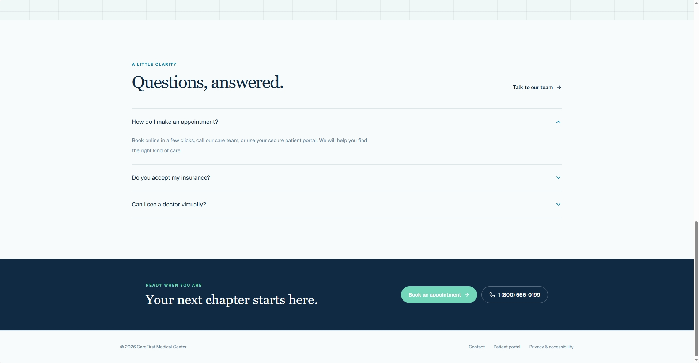
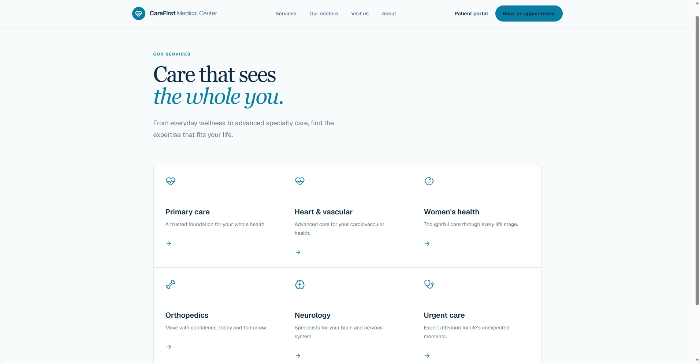
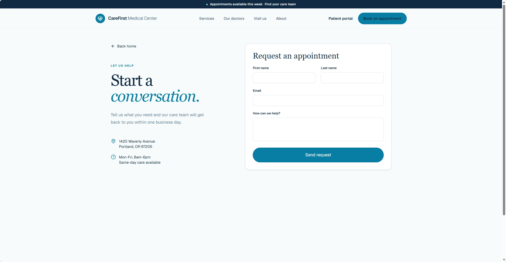
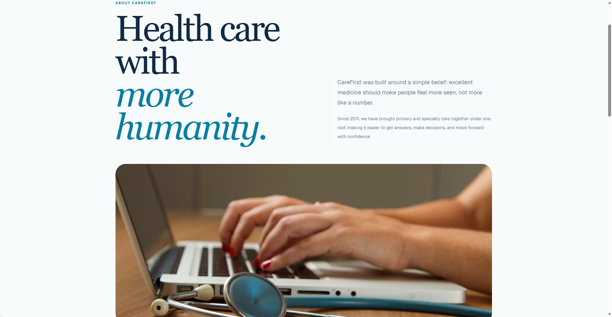
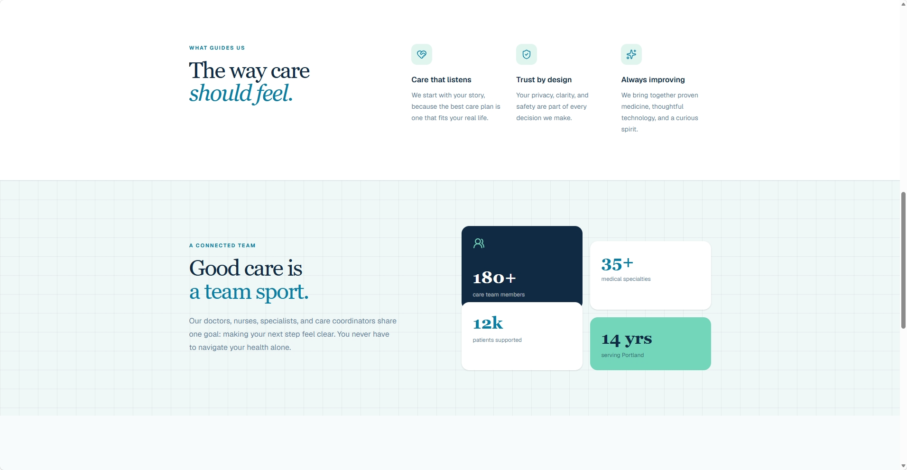
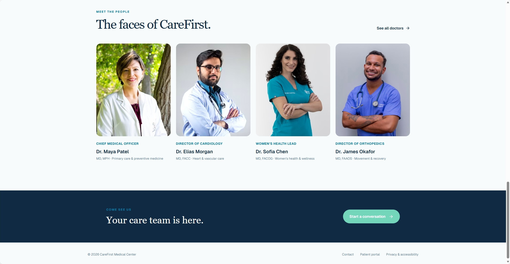
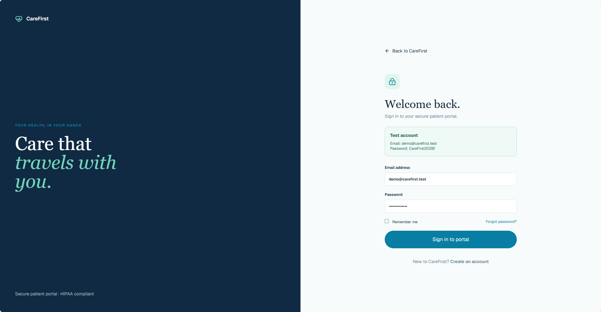
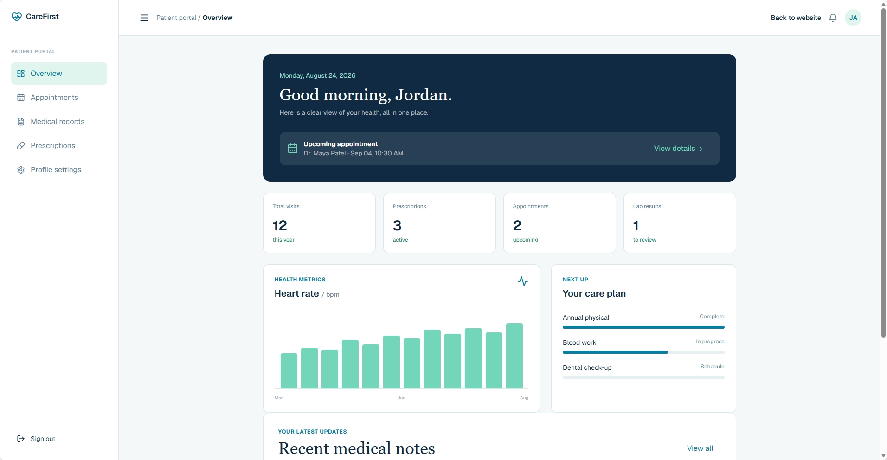

# 🏥 CareFirst Medical Center — Hospital Website & Client Portal

A modern, high-end, responsive multi-page hospital website and secure client portal built with **Next.js (App Router)**, **Tailwind CSS**, **Lucide React**, and **Framer Motion**. Designed with a calming clinical blue theme, rigorous accessibility standards, and smooth interactive animations.

---

## 📸 Application Screenshots & Gallery

Here is a quick look at the user interface and components:

| Localhost / Homepage Overview | Hero & Emergency Banner |
| :---: | :---: |
|  |  |

| Find a Doctor Directory | Medical Services & Departments |
| :---: | :---: |
|  |  |

| Appointment Booking Wizard | Patient Sign In / Authentication |
| :---: | :---: |
|  |  |

| Patient Sign Up Form | Client Portal Overview |
| :---: | :---: |
|  |  |

| Health Metrics Tracker & Graphs | Upcoming Appointments Management |
| :---: | :---: |
|  |  |

| Medical Records & Prescriptions | Emergency & Contact Support |
| :---: | :---: |
|  |  |

---

## ✨ Features & Architecture

### 🌐 Public Marketing Portal
* **Homepage (`/`):** Dynamic hero section, quick medical services ticker, statistics counters, featured doctors carousel, patient testimonials, and interactive FAQ accordions.
* **Find a Doctor (`/doctors`):** Advanced search & filter system by department (Cardiology, Pediatrics, Neurology, Orthopedics), credentials, ratings, and instant consultation booking triggers.
* **Services & Departments (`/services`):** Comprehensive department breakdowns with treatment overviews and departmental heads.
* **Emergency & Contact (`/contact`):** 24/7 hotline banner with direct dialing simulation, interactive inquiry form, visiting hours, and location maps.

### 🔐 Secure Authentication System
* **Sign In (`/auth/signin`):** Clean card layout with email/password inputs, "Remember me" option, and smooth redirection to the client portal.
* **Sign Up (`/auth/signup`):** Patient onboarding form capturing personal details, contact info, date of birth, and terms agreement with validation feedback.

### 📊 Secure Client Portal & Dashboard (`/dashboard`)
* **Persistent Sidebar Navigation:** Seamless switching between Overview, Appointments, Medical Records, Prescriptions, and Profile Settings.
* **Overview & Metrics Grid:** Real-time statistics cards tracking total visits, active prescriptions, upcoming appointments, and lab results.
* **Interactive Data Visualizations:** 
  * *Health Metrics Tracker:* Line charts monitoring blood pressure and heart rate trends over time.
  * *Check-up Milestone Breakdown:* Visual progress indicators for annual health goals.
* **Upcoming Appointments Feed:** Actionable table displaying scheduled consultations with status badges (`Confirmed`, `Pending`) and telehealth links.

---

## 🛠️ Tech Stack

* **Framework:** [Next.js](https://nextjs.org/) (App Router)
* **Styling:** [Tailwind CSS](https://tailwindcss.com/) (Utility-first CSS framework)
* **Icons:** [Lucide React](https://lucide.dev/) (Clean, modern iconography)
* **Animations:** [Framer Motion](https://www.framer.com/motion/) (Scroll reveals, layout transitions, spring physics modals)

---

## 🚀 Getting Started

### Prerequisites
Ensure you have [Node.js](https://nodejs.org/) (v18+ recommended) and npm/yarn installed on your machine.

### Installation & Local Development

1. Clone or navigate to your project directory:
   ```bash
   cd C:\Users\lifer\Documents\godfrey-profile\med
   ```

2. Install dependencies:
   ```bash
   npm install
   # or
   yarn install
   ```

3. Run the development server:
   ```bash
   npm run dev
   # or
   yarn dev
   ```

4. Open [http://localhost:3000](http://localhost:3000) in your browser to view the application.

---

## 📁 Project Directory Structure

```text
med/
├── app/                  # Next.js App Router directory
│   ├── auth/             # Authentication routes (signin, signup)
│   ├── dashboard/        # Secure client portal & analytics graphs
│   ├── doctors/          # Doctor directory & search filters
│   ├── services/         # Medical departments & procedures
│   ├── contact/          # Emergency contact & location info
│   ├── layout.tsx        # Root layout with global providers
│   └── page.tsx          # Homepage
├── components/           # Reusable UI components (Sidebar, Charts, Cards)
├── screenshots/          # Application UI screenshot captures
└── package.json          # Project dependencies & scripts
```

---

## 📄 License

This project is built for professional healthcare management and client portal interactions. 
